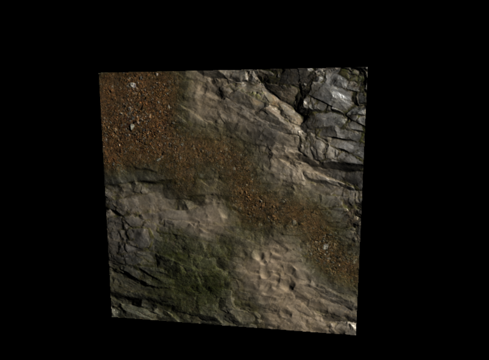
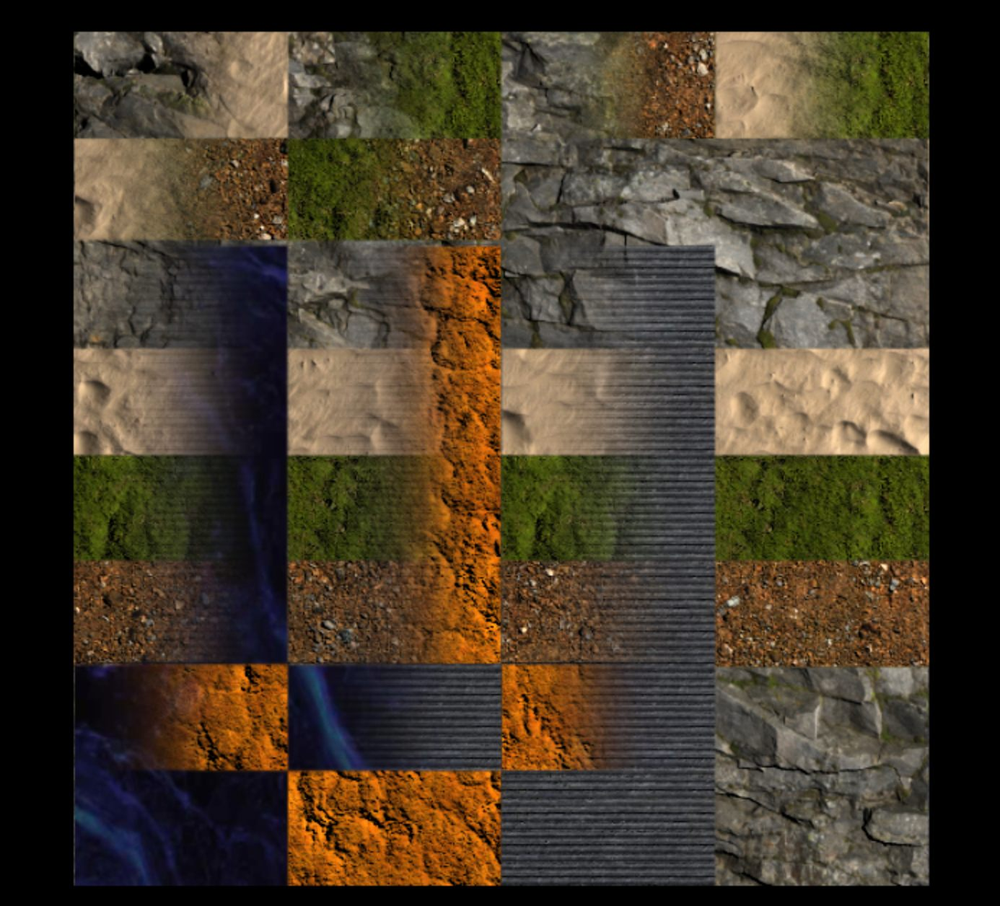

# textureSplat for ThreeJS

ThreeJS texture splatting class with diffuse, normal and ORM (ambient occlusion/roughness/metalness) maps.

The SplatterManager class creates a new standard material with texture splatting.
The shader is modified using onBeforeCompile to create the splats in one shader.

4 textures are blended together using a mixmap texture. The mixmap blends textures like this:
- red channel mixes textures 1 and 2.
- green channel mixes textures 3 and 4.
- blue channel mixes red and green.

Blended textures have their own diffuseMap, normalMap and ORM maps.

ORM maps contain the following:
- red channel - ambient occlusion
- green channel - roughness map
- blue channel - metalness map

Any texture can be mixed with any other textures without restriction.

This table shows how the mixmap colors relate to a specific texture at any given point:

| Material | mixmap1 color |
| -------- | ------------- |
| 1        | black #000000 |
| 2        | red   #FF0000 |
| 3        | blue  #0000FF |
| 4        | cyan  #00FFFF |

## 7-texture variant

The file `SplatterManager_7_materials_normal_diffuse.js` contains a version that combines 
7 different diffuse and normal maps, no ORM map, and 2 mix maps, as follows:

mix map 1:

- R1 -> textures 1 + 2
- G1 -> textures 3 + 4 
- B1 -> R1 + G1

mix map 2:

- R2 -> textures 5 + 6
- G2 -> texture 7 + R2
- B2 -> G2 + B1

This table shows how the mixmap colors must be configured in order for the shader
material to show a specific texture at any given point:

| Material | mixmap1 color | mixmap2 color  |
| -------- | ------------- | -------------- |
| 1        | black #000000 | blue   #0000FF |
| 2        | red   #FF0000 | blue   #0000FF |
| 3        | blue  #0000FF | blue   #0000FF |
| 4        | cyan  #00FFFF | blue   #0000FF |
| 5        | (any)         | green  #00FF00 |
| 6        | (any)         | yellow #FFFF00 |
| 7        | (any)         | black  #000000 |

This shader variant does not include ORM maps because for some GPU's, renderer.capabilities.maxTextures yields 16, which means no more than 16 textures can be used in a single shader. Exceeding this limit can result in the following error:

`Program Info Log: FRAGMENT shader texture image units count exceeds MAX_TEXTURE_IMAGE_UNITS(16)`

For maximum compatibility, ORM maps have been dropped to meet the 16 texture limit and avoid this error.

Since 7 pseudo-materials with one diffuse and one normal is 14 textures, plus 2 mixmaps means all 16 textures are used. 

This image shows 7 textures combined into a single shader with all possible blending combinations:

